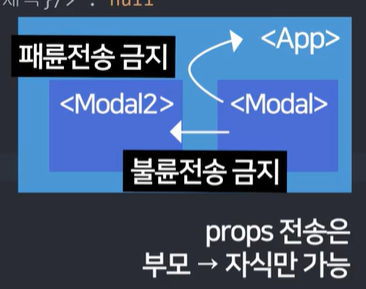

# React + Vite + Node.js

### JSX 문법 
- class 넣을땐 className
- 변수꽂을땐 {변수명}
- style 넣을땐 style = {{ 이름 : '값'}}
- return () 안에는 병렬로 태그 2개 이상 기입금지 
- 일반변수는 값변경시 자동으로 렌더링 안되기 때문에 자주 변경될 것 같은 html 부분은 state 변수를 사용해야 함
- js와 달리 jsx는 한줄주석(//) 사용불가, 태그 밖에 주석을 달려면 {/* */} 같은 형식으로 사용해야 함 


### 컴포넌트 분리
- 컴포넌트 분리 방법 : 각 func 밖에 새로운 func을 만들어주면 된다
- ✅ 장점 : 복잡한 html 을 컴포넌트 구조로 변경 가능
- ✅ 단점 : stete 가져다 쓸 떄 문제 생김, a함수에 있던 변수는 b 함수에서 마음대로 쓸 수 없음 


### props 
- 자식이 부모가 가지고 있던 state 사용 가능 
<div style="display:flex; gap: 10px">


</div>

### state 
- state를 만드는 곳은 stete 사용하는 컴포넌트들 중 최상위 컴포넌트 
- state 변경 함수는 늦게 처리됨 

### 이벤트 버블링 
- 클릭 이벤트는 상위 html로 퍼짐 

### 새로고침 
- 새로고침시 마다 html을 새로 읽기 때문에 따로 저장하지 않는이상, 화면의 값들은 휘발성

### 옛날 class 문법으로 컴포넌트 만들기 → 이제 함수형으로 바뀌어서 잘안쓰니 알아만 두기  
```
class Modal2 extends React.Component {
  constructor(){
    super()
  }

  render(){
    return (
      <div>안녕</div>
    )
  }

}
```