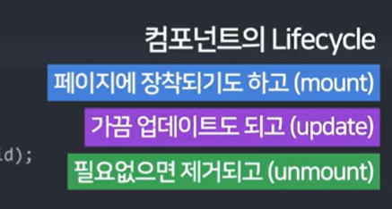

# React + Vite

### react-bootStrap CSS 적용 
- App.jsx 파일 상단에 react-bootstrap 임포트 
```
import { Button, Navbar, Container, Nav, NavDropdown } from 'react-bootstrap';
```

### 소스 내의 이미지 불러오기 

- 방법 1. hmtl에서 이미지 불러오기 
    - (1) App.jsx 파일 상단에 url 경로 임포트   
    ```
    import bg from '이미지경로'
    ```
    - (2) html 소스 안에서 변수에 담은 url 세팅
    ```
    <div style={{background: url('+bg+')''}}>
    </div>
    ```
- 방법 2. css 파일에서 이미지 불러오기 
    ```
    선택자 {
        background-image: url('.img/bg.png');    
    }
    ```
- 방법 3. public 폴더 이미지 불러오기 
    ```
    
    ```


### 다른 파일로 변수 내보내기/불러오기 (함수도 같은 방식)
- 다른 파일로 변수 내보내기 
```
// 다른 파일에서 a를 사용하려면 a가 있는 파일 하단에 다음과 같이 export 해주어야 함 
export default a
```
- 다른 파일로 변수 불러오기 
```
// 다른 파일에서 내보낸낸 a를 사용하려면 해당 변수를 사용할 폴더 상단에 import 해주어야 함 
import 작명 from '.불러올파일.확장자';
```

### router 
1. index.jsx 또는 main.jsx 둘 중 한 파일에 라우터 설정을 한다. 두 개가 같이 있으면 에러!
```
import React from 'react';
import ReactDOM from 'react-dom/client';
import App from './App';
import { BrowserRouter } from 'react-router-dom';
import 'bootstrap/dist/css/bootstrap.min.css';

const root = ReactDOM.createRoot(document.getElementById('root'));
root.render(
  <React.StrictMode>
    <BrowserRouter>
      <App />
    </BrowserRouter>
  </React.StrictMode>
);

```
2. App.jsx 파일에 라우터 경로를 지정한다. 
```
<Routes>
    <Route path="/" element={<HomePage shoes={shoes} />} />
    <Route path="/detail" element={<DetailPage />} />
</Routes>
```
3. 공통부를 제외한 각 업무단을 컴포넌트화 한다. 

### nested router
- nested router
```
<Route path="/about" element={<About />}>
    <Route path="member" element={<div>멤버 정보</div>} />
    <Route path="location" element={<div>위치 정보</div>} />
</Route>
```
- Outlet : 어느 위치에 보여줄건지 지정 하려면 outlet 설정 
```
function About() {
  return (
    <div>
      <h4>회사 정보</h4>
      <Outlet></Outlet>
      <p>이곳은 회사 소개 페이지입니다.</p>
    </div>
  );
}
```

### 컴포넌트 페이지 분리 
- 페이지명은 대문자로 시작 
- func + export 해주면 App.js에서 사용이 가능하다. 


### styled-components 
- js안에서 css 생성 및 적용하는 방법
- 장점 
  - 스타일이 다른 js 파일로 오염되지 않음 
  - css 거치지 않기 때문에 페이지 로딩시간 단축
- 단점 
  - js 파일이 복잡해짐 
  - 협업시 props 사용 등 숙련도 이슈 
```
npm install styled-components

import styled from 'styled-components';

# 기본 문법
let YellowBtn = styled.button`
  background: yellow;       
`

# 외부 라이브러리 사용법 
let YellowBtn = styled.button`
  background: ${ props => props.bg };       
`

<YellowBtn></YellowBtn>
```

### 컴포넌트의 라이프사이클
<div style="display:flex; gap: 10px">
  
</div>

### useEffect 사용하기 
- useEffect 안에 있는 코드는 html 렌더링 후에 동작
- 주로 [어려운 연산/서버에서 데이터 가져오는 작업/타이머 장착] 등에 쓰임 
1. 재렌더링마다 코드 실행하고 싶으면 
```
useEffect(()=>{ })
```
2. mount시 1회 코드 실행하고 싶으면 
```
useEffect(()=>{ }, [])
```
3. unmount시 1회 코드 실행하고 싶으면 
```
useEffect(()=>{ 
  return () => {}
}, [])
```
4. useEffect 실행 전에 뭔가 실행하려면 언제나 return () => {}
5. 특정 state 변경시에만 실행하려면 [state명]
```
useEffect(()=>{ }, [count])
```